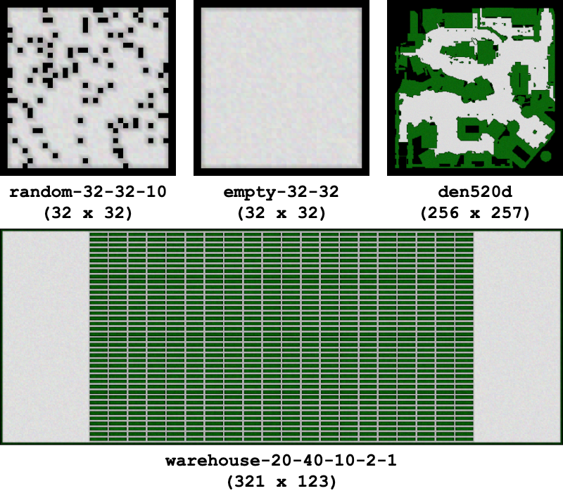
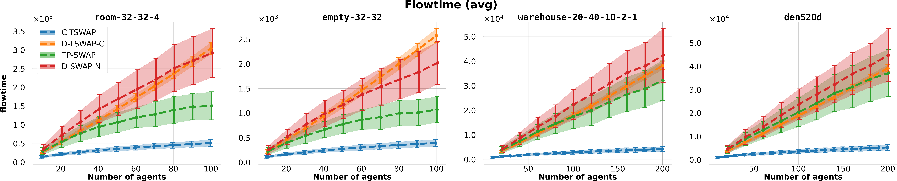
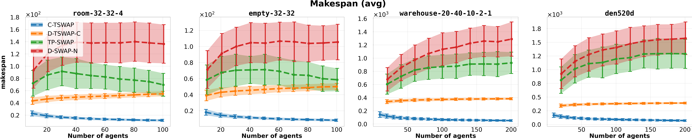
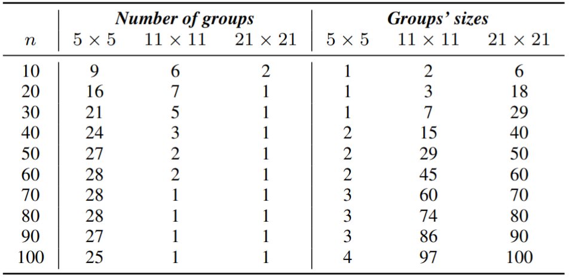
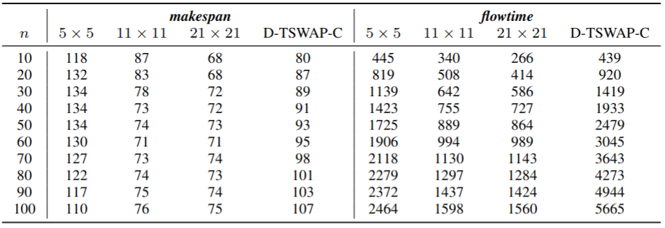

# Decentralized Unlabeled Multi-agent Pathfinding Via Target And Priority Swapping: Supplementary Materials

<p align="center">

<p\>

> [!Important]  
> **This repository contains supplementary materials for the paper:**
>
> Dergachev S., Yakovlev K. *Decentralized Unlabeled Multi-agent Pathfinding via Target and Priority Swapping*. Proceedings of the 27th European Conference on Artificial Intelligence (ECAI 2024). IOS Press, 2024, pp. 4344–4351.
>
> **[[Full text in Proceedings of ECAI 2024](https://ebooks.iospress.nl/volumearticle/70105)]**
>
> **[[Full text with supplementary materials on arXiv](https://arxiv.org/abs/2408.14948)]**

## Table of Content

1. [Further Evaluation On Additional Maps](#further-evaluation-on-additional-maps)
2. [Additional Evaluation Of The Impact Of Varying Communication Range](#additional-evaluation-of-the-impact-of-varying-communication-range)
3. [Citing this Work](#citing-this-work)
4. [Contacts](#contact)

## Further Evaluation On Additional Maps



To further validate the performance and scalability of the proposed decentralized algorithm, we conducted an additional series of experiments on two small (`random-32-32-10`, `empty-32-32`) and two large (`warehouse-20-40-10-2-1`, `den520d`) maps from the MovingAI benchmark.

Similarly to the experiments reported in the main body, we generated 250 different scenarios for each map, each scenario containing 100 start/target pairs on small maps and 200 start/target pairs on the large ones. The number of agents varied from 10 to 100 (20 to 200), with increments of 10 (20). The communication range for the decentralized algorithms was set to 5x5 cells with an agent in the center (as before).

The results are presented in the figures below. They generally align with those described in experimental section in the article. However, on the large maps, the difference between decentralized and centralized algorithms becomes more pronounced as the map size increases. Notably, the algorithm with the consistent initial goal assignment (D-TSWAP-C) shows superiority in makespan compared to the fully decentralized one (TP-SWAP). Despite this, the total solution duration (flowtime) remains similar across the solvers. Furthermore, as the number of agents increases, TP-SWAP begins to outperform D-TSWAP-C in terms of flowtime.

These effects can be attributed to the fact that the larger map size significantly complicates the coordination among decentralized agents. The inability to quickly recover a consistent assignment leads to the situations where some agents must visit multiple occupied targets before eventually finding an available one. This inefficiency contributes to widening of the performance gap between decentralized and centralized approaches on the larger maps.

Overall, the conducted additional experiments confirm that the proposed method is robust and capable of functioning effectively across various environments, including larger-scale settings. However, the size of the environment and the density of agents can notably impact the quality of its solutions, particularly when compared to the centralized algorithm.


Average ****flowtime**** and its standard deviation (shaded ahead) of the evaluated AMAPF solvers on an extended set of maps


Average ****makespan**** and its standard deviation (shaded ahead) of the evaluated AMAPF solvers on an extended set of maps

## Additional Evaluation Of The Impact Of Varying Communication Range

Tables below presents additional details of the experiment involving variation of the communication range. First table shows the ****makespan****, ****flowtime**** and second table contains statistics related to the subgroups of agents for each communication range across different numbers of agents. Additionally, first table includes results for the TSWAP algorithm with a consistent random initial assignment, denoted as D-TSWAP-C.

The results for the makespan and flowtime are consistent with those presented in experimental section in article. Notably, the proposed method surpasses the D-TPSWAP-C approach once a certain agent density threshold is reached. This advantage arises because TP-SWAP initially selects targets based on proximity, whereas D-TSWAP-C assigns targets randomly, potentially leading to greater initial distances between agents and their targets. As agent density increases, decentralized agents in TP-SWAP can rapidly re-establish a consistent assignment, often reaching better targets and thereby outperforming D-TSWAP-C.

Examining the statistics on the average number of subgroups and the average number of agents within these subgroups, we observe that with a communication range of $5 \times 5$, even with 100 agents on the relatively small $32 \times 32$ map, the agents do not consolidate into a single large group. Instead, they form multiple smaller subgroups. When fewer agents are present on the map, they tend to operate largely independently, only occasionally exchanging information. Despite this limited communication, the algorithm effectively solves the problem, as demonstrated by the results. Remarkably, it competes well with the partially centralized D-TSWAP-C method, even under these conditions.

On the other hand, increasing the communication radius facilitates full coordination among agents across the map, often leading to the formation of a single large connected group. However, it is important to note that even with a communication range of $11 \times 11$ and 100 agents on the map, the average number of agents in a group does not equal the total number of agents. This suggests that even in these scenarios, some agents occasionally operate independently and without constant communication with the rest.




## Citing This Work

If you use this repository in your research, please cite the following paper:

```bibtex
@inproceedings{dergachev2024decentralized,
  title={Decentralized Unlabeled Multi-agent Pathfinding via Target and Priority Swapping},
  author={Dergachev, S. and Yakovlev, K.},
  booktitle={Proceedings of the 27th European Conference on Artificial Intelligence (ECAI 2024)},
  year={2024},
  pages={4344--4351},
  publisher={IOS Press}
}
```

## Contact

For questions or further information, please contact:

* Stepan Dergachev (*dergachev@isa.ru* or *sadergachev@hse.ru*)
