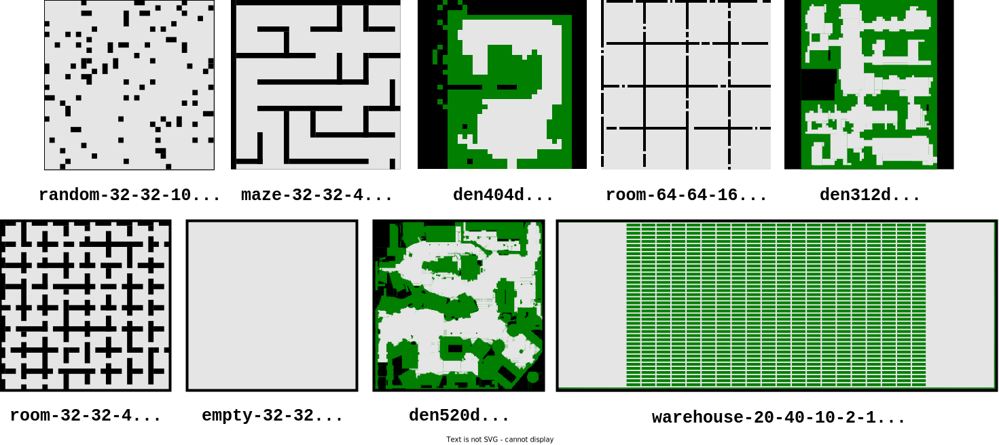

# Decentralized Unlabeled Multi-agent Pathfinding Via Target And Priority Swapping: Experiments

<p align="center">

<p\>

> [!Important]  
> **This repository contains code and data for the paper:**
>
> Dergachev S., Yakovlev K. *Decentralized Unlabeled Multi-agent Pathfinding via Target and Priority Swapping*. Proceedings of the 27th European Conference on Artificial Intelligence (ECAI 2024). IOS Press, 2024, pp. 4344–4351.
>
> **[[Full text in Proceedings of ECAI 2024](https://ebooks.iospress.nl/volumearticle/70105)]**
>
> **[[Full text with supplementary materials on arXiv](https://arxiv.org/abs/2408.14948)]**

## Description

This repository contains tasks, experimental results, and code for generating tasks, running experiments, as well as tools for processing and visualizing the results, as described in the referenced paper.

## Table of Content

1. [Repository Structure](#repository-structure)
2. [Requirements and Installation](#requirements-and-installation)
3. [Generating Scenarios](#generating-scenarios)
4. [Launching Experiments](#launching-experiments)
5. [Results Processing](#results-processing)
6. [Citing this Work](#citing-this-work)
7. [Contacts](#contact)
8. [References](#references)

## Project Structure

* `gen-scripts/`: Contains scripts for generating experimental tasks.
  * `movingai_maps/`: Directory to store MovingAI maps (Maps are automaticly downloading by `generate_movingai_map_tasks.py` script).
  * `tasks/`: Directory to store generated task files.
  * `generate_empty_tasks.py`: Script to generate tasks on empty grid maps.
  * `generate_movingai_map_tasks.py`: Script to generate tasks using MovingAI benchmark maps.

* `launching`: Contains scripts and resources for launching experiments.
  * `results/`: Directory to store results of the experiments.
  * `img/`: Directory for storing generated visualizations and animations.
  * `utils.py`: Utility functions for running experiments.
  * `visualization.py`: Functions for visualizing solutions.
  * `single_run.ipynb`: Jupyter Notebook for running a single experiment.
  * `multiple_run.ipynb`: Jupyter Notebook for running multiple experiments with single algorithm on single map.
  * `run_experiments.py`: Main python script for running full-scale experiments with multiple algorithms on multiple maps.

* `processing/`: Contains code for processing experimental results.
  * `results_processing.ipynb`: A Jupyter notebook for processing the data in `results/` and generating tables and plots to visualize the results.
  * `img/`: Contains plots generated from processing the experimental results.

* `results/`: Contains experimental results organized by map and algorithm:
  * `*map_name*/`: Each map used in the experiments has its own folder.
    * `*algorithm_name*/`: Within each map folder, there are subfolders named after the evaluated algorithms.
      * `result.txt`: Contains evaluation metrics for each algorithm, including ****flowtime**** and ****makespan****.
  * `all/`: This subfolder contains all intermediate results of experiments obtained during the preparation of the paper.
* `tasks/`: Contains generated tasks for each map.
  * `*map_name*/`: Each map used in the experiments has its own folder.
    * `*num*_task.xml`: XML files with task configurations.
    * `map.xml`: XML file with map information.
    * `*algorithm_name*_config.xml`: Configuration files for each algorithm.

## Requirements and Installation

### Main Requirements

To use the repository, install the following software and libraries:

* `wget`
* `Python 3.11`
* `IPython and Jupyter Notebook`
* `setuptools`
* `numpy`
* `pandas`
* `matplotlib`
* `tqdm`

### Additional Libraries

#### Multi-agent Navigation Library (`manavlib`)

The `manavlib` library provides utility functions for multi-agent navigation experiments, including tools for handling XML configuration files, generating tasks, and creating maps.

**Installation:** You can find detailed installation instructions in the `manavlib` GitHub repository. In brief, to install `manavlib (v1.0)` directly from its [[**GitHub**]](https://github.com/haiot4105/multi-agent-nav-lib) source (on Linux or macOS), use the following command:

```bash
git clone git@github.com:haiot4105/multi-agent-nav-lib.git
cd multi-agent-nav-lib
pip install -e .
```

#### AMAPF Algorithms Implementation (`dec_tswap`)

The `dec_tswap` package includes the implementation of the suggested decentralized AMAPF TP-SWAP algorithm and related  solvers. It is located in the `main` branch of this repository.

**Installation:** You can find detailed installation instructions in the `main` branch of this repository. In brief, to install `dec_tswap` directly from the GitHub source (on Linux or macOS), use the following command:

```bash
git clone git@github.com:PathPlanning/TP-SWAP.git tp-swap
cd tp-swap
pip install -e .
```

### Installation

After all requirements was installed, you should clone this repo in separate folder and switch to `experiments` branch (tested on Linux and macOS):

```bash
git clone git@github.com:PathPlanning/TP-SWAP.git tp-swap-exp
git checkout experiments
```

## Generating Scenarios

This project provides next tools to generate tasks for the experiments (tested on Linux and macOS).

1. Generate tasks on empty grid map:

```bash
python gen-scripts/generate_empty_tasks.py
```

2. Generate tasks on `MovingAI` grid maps:

```bash
python gen-scripts/generate_movingai_map_tasks.py
```

In order to configure the parameters of the generated tasks (such as the number of tasks, maximum number of agents, the number of steps in the experiment, etc.) it is necessary to modify the source code of the scripts. In order to generate a tasks on one of the `MovingAI` maps, it is necessary to add a link to the corresponding `zip archive` to the script `gen-scripts/generate_movingai_map_tasks.py` or add the coresponding `.map` file to folder `gen-scripts/movingai_maps`. An example of links to the site can be found in script `gen-scripts/generate_movingai_map_tasks.py`.

## Launching Experiments

### Input

> [!Note]
> You can learn more about the structure of input XML files by looking at the `manavlib` [**GitHub**](https://github.com/haiot4105/multi-agent-nav-lib) or explore `tasks/example` folder.

All input data for the algorithms must be specified using XML files. This project adopts the XML input format provided by the `manavlib` library. Each experiment requires the following set of files:

* `map.xml`: Defines the static environment (occupancy grid data).

**Example:**

```xml
<?xml version="1.0" ?>
<root>
 <occupancy_grid>
  <width>10</width>
  <height>10</height>
  <cell_size>1.0</cell_size>
  <grid>
    <row>0 0 0 0 0 0 0 0 0 0</row>
    <row>0 0 0 0 0 0 0 0 0 0</row>
    <row>0 0 0 0 0 0 0 0 0 0</row>
    <row>0 0 0 0 0 0 0 0 0 0</row>
    <row>0 0 0 0 0 0 0 0 0 0</row>
    <row>0 0 0 0 0 0 0 0 0 0</row>
    <row>0 0 0 0 0 0 0 0 0 0</row>
    <row>0 0 0 0 0 0 0 0 0 0</row>
    <row>0 0 0 0 0 0 0 0 0 0</row>
    <row>0 0 0 0 0 0 0 0 0 0</row>
  </grid>
 </occupancy_grid>
</root>
```

* `*alg_name*_config.xml` (single or multiple): Specifies the experiment setup and algorithm configuration. Only the max_steps parameter is used in this context (other parameters are designed for experiments in continuous environments).

**Example:**

```xml
<?xml version="1.0" ?>
<root>
 <experiment>
  <timestep>1.0</timestep>
  <xy_goal_tolerance>0</xy_goal_tolerance>
  <max_steps>1000</max_steps>
 </experiment>
 <algorithm name="base_tswap">
  <centralized>0</centralized>
 </algorithm>
</root>
```

* `task.xml` (single or multiple): Defines agent configurations, including initial and goal positions..

**Example:**

```xml
<?xml version="1.0" ?>
<root>
 <default_agent model_type="base_discrete" size="0.3" r_vis="2"/>
 <agents number="4">
  <agent id="0" s.i="0" s.j="3" g.i="3" g.j="0"/>
  <agent id="1" s.i="1" s.j="2" g.i="2" g.j="1"/>
  <agent id="2" s.i="2" s.j="1" g.i="1" g.j="2"/>
  <agent id="3" s.i="3" s.j="0" g.i="7" g.j="3"/>
 </agents>
</root>
```

#### Agents Configuarations

<p align="center">

<p\>

In the experiments, all agents are assumed to have identical properties, so only the default parameters need to be specified under the `<default_agent>` section. The agent type should be set to `base_discrete`. The parameter `size` specifies the agent’s radius (used arbitrarily in this context). The parameter `r_vis` defines an agent’s visibility radius, which determines the communication range. The communication range formed as a square area centered on the agent’s position, with a side length of `2 * r_vis + 1`. See the illustration for more details.

### Available Tasks

This repository includes a set of tasks used in the experiments described in the referenced paper. The tasks are based on grid maps from the MovingAI benchmark collection [[1](https://arxiv.org/abs/1906.08291), [2](https://www.movingai.com/)]. The figure below shows an illustration of the maps used:



For each map, 250 tasks (`*num*_task.xml` files) have been created, each containing 200 pairs of start and goal positions. These tasks are organized in subdirectories under the `tasks/` folder, where each subdirectory corresponds to a specific map name. The subdirectories also include `map.xml` file, which contains the grid map data and `*alg_name*_config.xml` configuration files for specific algorithms.

For the maps `maze-32-32-4` and `rooms-64-64-16`, tasks with varying visibility radius parameters (`r_vis`) are stored in separate subdirectories. For example, you can find tasks in the folders `maze-32-32-4-2`, `maze-32-32-4-5`, and `maze-32-32-4-10`, which correspond to communication ranges of $5 \times 5$, $11 \times 11$, and $21 \times 21$, respectively. These tasks are used to evaluate the impact of different communication ranges on the performance of the TP-SWAP algorithm.

### Supported Algorithms

This project currently supports the following baseline policies and AMAPF algorithms:

* `random`: A baseline policy where agents move randomly without a specific strategy.
* `smart_random`: An improved `random` policy where agents agents move randomly, but avoid  collisions with obstacles.
* `shortest_path`: Agents follow the shortest path to their closest targets using precomputed paths.
* `base_tswap` or `D-TSWAP-C`: A semi-decentralized solver based on TSWAP with consistent initial assignment and decentralized operation. It also supports a centralized mode by setting the `centralized` option to `true` in the configuration file.
* `naive_dec_tswap` or `D-TSWAP-N`: A naive fully decentralized solver based on TSWAP.
* `dec_tswap` or `TP-SWAP`: The proposed fully decentralized solver.

The implementations of these algorithms are located in the `main` branch of this repository. Example configuration files for each algorithm can be found in the `tasks/example` folder.

#### Evaluate Own AMAPF Algorithm

You can also evaluate a custom AMAPF algorithm. To do this:

1. Implement your algorithm in a similar way to the existing algorithms in the `dec_tswap` module (refer to the `main` branch for detailed examples).
2. Create a corresponding configuration file (following the examples in the `tasks/example` folder).
3. Import your algorithm classes into `launching/utils.py` and add them to the `get_agent_type(agents_params)` function.

#### Evaluating Original Centralized TSWAP

To run experiments with the original centralized TSWAP algorithm [[3](https://arxiv.org/abs/2109.04264)] (referred to as C-TSWAP in the paper), use the task files from this repository in combination with the experiment scripts provided in `manavlib`. Detailed instructions can be found in the README of `manavlib` on [[**GitHub**]](https://github.com/haiot4105/multi-agent-nav-lib).

### Launch

To conduct experiments (on Linux or macOS), use the provided Jupyter Notebooks and Python scripts located in the `launching/` folder:

1. Launch `single_run.ipynb` in Jupyter Notebook to run a single experiment and obtain a vizaulisation.

2. Launch `multiple_run.ipynb` to conduct a series of experiments with a single algorithm on a specific map. This notebook also provides statistics such as success rate and average flowtime, makespan, runtime for successful tasks.

3. Use `run_experiments.py` to perform a comprehensive evaluation across multiple algorithms and configurations. For detailed information about the available options and parameters, run:

```bash
python run_experiments.py -h
```

or

```bash
python run_experiments.py --help
```

## Results Processing

After running the experiments, the results are saved in `result.txt` files. Each `result.txt` file contains metrics from multiple experimental runs for a specific algorithm on a given map. Each line in the file corresponds to a single experimental run and includes the following columns:

* `success`: Indicates whether the experiment successfully completed (`1` for success, `0` for failure).
* `collision`: Total number of collisions between agents.
* `collision_obst`: Number of collisions between agents and obstacles.
* `makespan`: The total time (steps) taken until the last agent reaches its target.
* `flowtime`: The sum of all agents’ travel times (in steps).
* `runtime`: Computation time for the experiment.
* `mean_groups`: Average number of groups formed during the experiment (optional, not recorded in all experiments).
* `mean_groups_size`: Average size of each group (optional, not recorded in all experiments).
* `number`: Number of agents involved in the experiment.

An examlple of `result.txt` file content:

```txt
success  collision  collision_obst   makespan   flowtime    runtime     number
      1          0               0         76        259      0.109         10
      1          0               0         33        137      0.049         10
      1          0               0         71        295      0.106         10    
```

The `results/` folder contains the collected experimental data for various grid maps and AMAPF solvers. The following grid maps from the MovingAI benchmark [[1](https://arxiv.org/abs/1906.08291), [2](https://www.movingai.com/)] were used in the experiments (as described in the [Available Tasks](#available-tasks) section and the referenced paper):

* `random-32-32-10`
* `maze-32-32-4`
* `den404d`
* `room-64-64-16`
* `den312d`
* `room-32-32-4`
* `empty-32-32`
* `den520d`
* `warehouse-20-40-10-2-1`

The following algorithms were tested during the experiments:

* **`dec-tswap` or `TP-SWAP`**: The proposed decentralized AMAPF solver.
  * `dec-tswap-2`, `dec-tswap-5`, and `dec-tswap-10`: Variants with different communication ranges:
    * `dec-tswap-2`: Sight radius of `2` cells, equivalent to a `5x5` communication range.
    * `dec-tswap-5`: Sight radius of `5` cells, equivalent to an `11x11` communication range.
    * `dec-tswap-10`: Sight radius of `10` cells, equivalent to a `21x21` communication range.
* **`origin-tswap` or `C-TSWAP`**: A centralized AMAPF solver (state-of-the-art) [[3](https://arxiv.org/abs/2109.04264)], with results obtained using the original implementation [[4](https://github.com/Kei18/tswap)].
* **`base-tswap` or `D-TSWAP-C`**: A semi-decentralized AMAPF solver based on TSWAP with a consistent initial assignment and decentralized operation.
* **`naive-dec-tswap` or `D-TSWAP-N`**: A naive, fully decentralized AMAPF solver based on TSWAP.

The `processing/results_processing.ipynb` notebook provides code for loading, analyzing, and visualizing the experimental data (tested on Linux and macOS).  Run the notebook to produce tables and plots for metrics like ****flowtime**** and ****makespan****, as presented in the paper. Plots generated by processing the results are saved in the `processing/img/` subfolder.

## Citing This Work

If you use this repository in your research, please cite the following paper:

```bibtex
@inproceedings{dergachev2024decentralized,
  title={Decentralized Unlabeled Multi-agent Pathfinding via Target and Priority Swapping},
  author={Dergachev, S. and Yakovlev, K.},
  booktitle={Proceedings of the 27th European Conference on Artificial Intelligence (ECAI 2024)},
  year={2024},
  pages={4344--4351},
  publisher={IOS Press}
}
```

## Contact

For questions or further information, please contact:

* Stepan Dergachev (*<dergachev@isa.ru>* or *<sadergachev@hse.ru>*)

## References

1. [Stern R. et al. *Multi-agent pathfinding: Definitions, variants, and benchmarks*. Proceedings of the 12th Annual Symposium on Combinatorial Search (SoCS 2019), 2019, pp. 151–158.](https://arxiv.org/abs/1906.08291)
2. [MovingAI Lab](https://www.movingai.com/)
3. [K. Défago X. *Solving Simultaneous Target Assignment and Path Planning Efficiently with Time-Independent Execution*. Proceedings of the International Conference on Automated Planning and Scheduling (ICAPS 2022), vol. 32, 2022, pp. 270–278.](https://arxiv.org/abs/2109.04264)
4. [GitHub repository with implementation of TSWAP algorithm](https://github.com/Kei18/tswap)
  